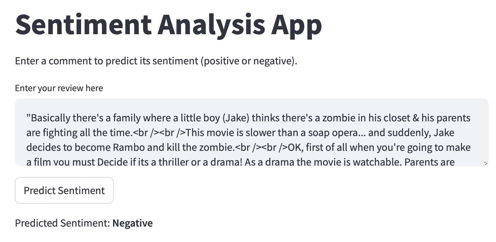

# NLP sentiment analysis on IMDB dataset


Use this command to run
```bash
# install requirements
pip install -r requirements.txt
streamlit run app.py
```

**Input samples:**
* Positive:
```
"One of the other reviewers has mentioned that after watching just 1 Oz episode you'll be hooked. They are right, as this is exactly what happened with me.<br /><br />The first thing that struck me about Oz was its brutality and unflinching scenes of violence, which set in right from the word GO. Trust me, this is not a show for the faint hearted or timid. This show pulls no punches with regards to drugs, sex or violence. Its is hardcore, in the classic use of the word.<br /><br />It is called OZ as that is the nickname given to the Oswald Maximum Security State Penitentary. It focuses mainly on Emerald City, an experimental section of the prison where all the cells have glass fronts and face inwards, so privacy is not high on the agenda. Em City is home to many..Aryans, Muslims, gangstas, Latinos, Christians, Italians, Irish and more....so scuffles, death stares, dodgy dealings and shady agreements are never far away.<br /><br />I would say the main appeal of the show is due to the fact that it goes where other shows wouldn't dare. Forget pretty pictures painted for mainstream audiences, forget charm, forget romance...OZ doesn't mess around. The first episode I ever saw struck me as so nasty it was surreal, I couldn't say I was ready for it, but as I watched more, I developed a taste for Oz, and got accustomed to the high levels of graphic violence. Not just violence, but injustice (crooked guards who'll be sold out for a nickel, inmates who'll kill on order and get away with it, well mannered, middle class inmates being turned into prison bitches due to their lack of street skills or prison experience) Watching Oz, you may become comfortable with what is uncomfortable viewing....thats if you can get in touch with your darker side."
```

* Negative:
```
"Basically there's a family where a little boy (Jake) thinks there's a zombie in his closet & his parents are fighting all the time.<br /><br />This movie is slower than a soap opera... and suddenly, Jake decides to become Rambo and kill the zombie.<br /><br />OK, first of all when you're going to make a film you must Decide if its a thriller or a drama! As a drama the movie is watchable. Parents are divorcing & arguing like in real life. And then we have Jake with his closet which totally ruins all the film! I expected to see a BOOGEYMAN similar movie, and instead i watched a drama with some meaningless thriller spots.<br /><br />3 out of 10 just for the well playing parents & descent dialogs. As for the shots with Jake: just ignore them."
```

## Text preprocessing
Text preprocessing is an essential step in Natural Language Processing (NLP) to prepare raw text data for further analysis, modeling, or machine learning. Here are the key text preprocessing techniques:

### 1. **Lowercasing**
   - Convert all text to lowercase to ensure uniformity and avoid treating words like "Apple" and "apple" as different.
   - Example: "Hello World" → "hello world"

### 2. **Tokenization**
   - Split the text into smaller units like words, sentences, or subwords.
   - Example: "I love NLP" → ["I", "love", "NLP"]

### 3. **Stopwords Removal**
   - Remove common words (e.g., "and", "the", "is") that don’t contribute much to the meaning of a sentence.
   - Example: "This is a simple example" → ["simple", "example"]

### 4. **Punctuation Removal**
   - Remove punctuation marks as they usually do not contribute much meaning (though this depends on the task).
   - Example: "Hello, World!" → "Hello World"

### 5. **Lemmatization**
   - Convert words to their base or dictionary form, taking grammatical rules into account.
   - Example: "better" → "good", "running" → "run"

### 6. **Stemming**
   - Strip words to their base form by removing suffixes and prefixes.
   - Example: "caring", "cars" → "car"

### 7. **Removing Numbers**
   - Remove numerical digits from the text, unless the numbers have significance for the analysis.
   - Example: "In 2024, AI will dominate" → "AI will dominate"

### 8. **Removing Special Characters**
   - Remove symbols like $, %, @, etc., unless they are relevant.
   - Example: "I paid $100!" → "I paid 100"

### 9. **Removing URLs and HTML Tags**
   - Strip out any web links or HTML tags from the text.
   - Example: "Visit <a href='https://example.com'>this site</a>" → "Visit this site"

### 10. **Text Normalization**
   - Normalize text by expanding contractions (e.g., "don't" → "do not") or handling spelling corrections.
   - Example: "can't" → "cannot", "thx" → "thanks"

### 11. **Handling Misspellings**
   - Correct common spelling errors in the text.
   - Example: "recieve" → "receive"

### 12. **Part-of-Speech (POS) Tagging**
   - Tag each word with its corresponding part of speech (noun, verb, etc.), which can be useful for more advanced NLP tasks.
   - Example: "Running is fun" → [("Running", "VBG"), ("is", "VBZ"), ("fun", "NN")]

### 13. **Text Vectorization**
   - Convert text into numerical representation for machine learning algorithms. Common techniques include:
     - **Bag of Words (BoW)**: Represent the document by counting the occurrence of each word.
     - **TF-IDF (Term Frequency-Inverse Document Frequency)**: Weighs terms by their frequency and uniqueness across documents.
     - **Word Embeddings**: Represent words as dense vectors (e.g., Word2Vec, GloVe).

### 14. **Sentence Segmentation**
   - Divide text into meaningful sentences, which is especially useful for tasks like summarization or parsing.

### 15. **Handling Repeated Characters**
   - Reduce repeated characters in text.
   - Example: "sooooo good" → "so good"

### 16. **Handling Emoji and Emoticons**
   - Depending on the task, emojis can be removed, replaced with text (e.g., 😊 → "happy"), or analyzed as features.

### 17. **Handling Slang and Abbreviations**
   - Expand slang or abbreviations for uniformity.
   - Example: "OMG" → "Oh my God", "BTW" → "By the way"

## Encoding techniques

### 1. **Label Encoding**
Label Encoding is used to convert categorical data into numerical labels. Each unique category is assigned an integer value.

#### Example:
If we have a categorical feature with values: `['red', 'green', 'blue']`, Label Encoding would map each label to an integer:
- 'red' → 0
- 'green' → 1
- 'blue' → 2

```python
from sklearn.preprocessing import LabelEncoder

# Example data
colors = ['red', 'green', 'blue', 'green', 'blue', 'red']

# Create LabelEncoder object
le = LabelEncoder()

# Apply LabelEncoder
encoded_labels = le.fit_transform(colors)
print(encoded_labels)  # Output: [2 1 0 1 0 2]
```

**Note:** Label encoding assumes a natural order between categories, so it's best used when there is such an order.

### 2. **One-Hot Encoding**
One-Hot Encoding converts categorical variables into a binary matrix. Each category is represented by a binary vector where only the index corresponding to the category is 1, and all others are 0.

#### Example:
For the categorical feature `['red', 'green', 'blue']`, One-Hot Encoding will produce the following:
- 'red' → [1, 0, 0]
- 'green' → [0, 1, 0]
- 'blue' → [0, 0, 1]

```python
from sklearn.preprocessing import OneHotEncoder
import numpy as np

# Example data
colors = np.array(['red', 'green', 'blue', 'green', 'blue', 'red']).reshape(-1, 1)

# Create OneHotEncoder object
ohe = OneHotEncoder(sparse_output=False)

# Apply OneHotEncoder
one_hot_encoded = ohe.fit_transform(colors)
print(one_hot_encoded)
# Output: [[1. 0. 0.]
#          [0. 1. 0.]
#          [0. 0. 1.]
#          [0. 1. 0.]
#          [0. 0. 1.]
#          [1. 0. 0.]]
```

### 3. **Bag of Words (BoW) Encoding**
Bag of Words is a method to represent text data by counting the occurrences of words in a document or text. It disregards the word order and focuses only on word frequency.

#### Example:
Consider two sentences:
1. "I love machine learning."
2. "Machine learning is awesome."

The Bag of Words matrix would look like this:

|          | I | love | machine | learning | is | awesome |
|----------|---|------|---------|----------|----|---------|
| Sentence 1 | 1 | 1    | 1       | 1        | 0  | 0       |
| Sentence 2 | 0 | 0    | 1       | 1        | 1  | 1       |

```python
from sklearn.feature_extraction.text import CountVectorizer

# Example data
documents = ["I love machine learning", "Machine learning is awesome"]

# Create CountVectorizer object
vectorizer = CountVectorizer()

# Apply Bag of Words
bow_matrix = vectorizer.fit_transform(documents).toarray()

# Show BoW matrix
print(bow_matrix)
print(vectorizer.get_feature_names_out())
# Output:
# [[1 1 0 1 1 0]
#  [0 0 1 1 1 1]]
# ['awesome' 'is' 'love' 'machine' 'learning' 'i']
```

### 4. **TF-IDF (Term Frequency-Inverse Document Frequency)**
TF-IDF is a more advanced technique that weighs the importance of a word in a document relative to its frequency in a corpus. It combines two metrics:
- **Term Frequency (TF)**: Measures how frequently a word appears in a document.
- **Inverse Document Frequency (IDF)**: Measures how important a word is by considering its rarity across all documents.

A higher TF-IDF score means a word is frequent in a specific document but rare across the entire dataset.

#### Example:
For the same two sentences:
1. "I love machine learning."
2. "Machine learning is awesome."

TF-IDF might assign higher weights to rare words like "awesome" and lower weights to common words like "machine" or "learning".

```python
from sklearn.feature_extraction.text import TfidfVectorizer

# Example data
documents = ["I love machine learning", "Machine learning is awesome"]

# Create TfidfVectorizer object
tfidf_vectorizer = TfidfVectorizer()

# Apply TF-IDF
tfidf_matrix = tfidf_vectorizer.fit_transform(documents).toarray()

# Show TF-IDF matrix
print(tfidf_matrix)
print(tfidf_vectorizer.get_feature_names_out())
# Output:
# [[0.        0.        0.70710678 0.70710678 0.        0.        ]
#  [0.4472136 0.4472136 0.         0.         0.4472136 0.4472136]]
# ['awesome' 'is' 'love' 'machine' 'learning' 'i']
```

In this example, words that appear across both documents (like "machine" and "learning") are weighted lower, while unique words like "awesome" and "love" are weighted higher.

### **Comparative Analysis**

| Technique      | Advantages                                                        | Disadvantages                                                     | Ideal Use Cases                                                 |
|----------------|--------------------------------------------------------------------|-------------------------------------------------------------------|----------------------------------------------------------------|
| **Label Encoding** | Simple, memory efficient, suitable for ordinal features         | Assumes an order between categories, may introduce bias            | Ordinal categorical features (e.g., rankings)                  |
| **One-Hot Encoding** | No order assumption, interprets categories as independent      | High dimensionality, inefficient for large categorical variables   | Nominal categorical variables with manageable categories        |
| **Bag of Words (BoW)** | Simple, interprets text by frequency                        | Ignores word order and context, produces large sparse matrices     | Small- to medium-sized datasets for text classification         |
| **TF-IDF**         | Weighs important words, reduces common word over-representation | Still ignores word order, computationally expensive for large corpora | Information retrieval, document classification, text similarity |